# MU5735 — Independent Investigation Report

**Flight:** China Eastern Airlines MU5735
**Aircraft:** Boeing 737-89P, registration **B-1791**, MSN 41474
**Route:** Kunming Changshui (KMG/ZPPP) → Guangzhou Baiyun (CAN/ZGGG)
**Date / Time of accident:** 2022‑03‑21, ~06:20 UTC (14:20 Beijing time)
**Location of impact:** Mountainous terrain near Molang, Wuzhou, Guangxi, P.R. China
**On board:** 123 passengers + 9 crew — **no survivors**

> ## Disclaimer
> This document is an **independent technical analysis** prepared from the public materials archived in this
> repository (NTSB FOIA release DCA22WA102: the Cockpit Voice and Flight Data Recorder Combined Download
> Report, the FDR sample data set `ExactSample.csv`, the parameter resolution table `TableResolution.csv`,
> and the NTSB ↔ CAAC correspondence letters `res_letter_1/2/3.png` and `rzcommu.pdf`).
>
> The **CAAC (Civil Aviation Administration of China)** is the State of Occurrence and the only authority
> empowered under ICAO Annex 13 to publish the official accident report. As of the date this analysis was
> written, CAAC has only released two preliminary statements (April 2022 and one‑year and two‑year
> anniversary updates) and has not published the final report. **Nothing in this document should be read
> as an official accident finding.** It is an analytical reading of the data publicly available in this
> repository.

---

## 1. Sources used in this analysis

| File in this repository | Description |
|---|---|
| `report.pdf`, `report (2).pdf` … `report (7).pdf` | NTSB Office of Research and Engineering — *Cockpit Voice and Flight Data Recorder Combined Download Report*, DCA22WA102, 2022‑07‑01 |
| `MU5735_NTSB_Recorder_Report_CN/MU5735_NTSB_Recorder_Report_Chinese.md` | Unofficial Chinese translation of the above NTSB report |
| `ExactSample.csv` | NTSB‑provided FDR parameter sample, 165 channels, ≈13 minutes (288 200.6 – 288 977.5 s recorder time), covering cruise → upset → loss of FDR data |
| `TableResolution.csv` | Engineering‑units resolution / encoding for each FDR channel |
| `12minute.upk` | Original Boeing AGS analysis package referenced in the NTSB report |
| `res_letter_1.png`, `res_letter_2.png`, `res_letter_3.png` | NTSB letters to CAAC concerning data sharing and recorder analysis |
| `rzcommu.pdf` | NTSB / Boeing communication concerning the recorders |

The figures embedded below were generated directly from `ExactSample.csv` by the script
[`scripts/analyze.py`](scripts/analyze.py).

---

## 2. Executive summary

The FDR sample in this repository covers approximately the **last 13 minutes** of the flight. For about
**12 minutes 40 seconds** of that window the aircraft was in stable, level cruise at FL290 (~29 100 ft),
on autopilot, with both engines producing ~84 % N1 and the MCP altitude window selected to 29 088 ft.

At sample‑relative time **t ≈ 759 s** the airplane departed level flight: pitch attitude began to fall, the
nose dropped through the horizon at t ≈ 762 s, and the airplane entered a near‑vertical dive that exceeded
**−36° pitch** and **340 kt** airspeed by the time the FDR sample ends at **t ≈ 777 s** (FL254). During
this 18‑second window:

* **Throttle lever angle (TRA) stayed essentially constant** at the previous cruise setting (~59°), but
  both engines simultaneously spooled down — Eng 2 from 84 % to 0 % N1, Eng 1 from 84 % to 26 % N1, in
  about 10 seconds.
* **Selected altitude on the MCP did not change** — it remained at 29 088 ft throughout the dive,
  inconsistent with any deliberate, programmed descent.
* No engine fire, no engine cutoff‑switch event, and no hydraulic pressure loss were captured in the
  sample.
* Roll reached almost ±180° (the aircraft rolled through inverted) before the FDR sample stopped.

These data are consistent with the publicly described radar track (an aircraft cruising normally at
FL290, then descending more than 20 000 ft in roughly 90 seconds, briefly arresting the descent, then
diving again into terrain). The combination of (a) a sustained, large nose‑down attitude, (b) MCP/AP
targets unchanged, (c) no recorded mechanical fault, and (d) airspeed driven well above the airplane's
maximum operating speed, points strongly toward **a deliberate or pilot‑induced flight‑control input**
as the most likely proximate cause, with no evidence of an airframe, engine, hydraulic or flight‑control
system malfunction in the FDR sample.

This conclusion is consistent with the publicly reported preliminary view of NTSB / FAA technical staff
(reflected in the recorder report and supporting correspondence in this repository) that the airplane
was placed into the dive **by inputs to the controls**, rather than by a mechanical failure of the
airplane.

---

## 3. The data set

* **Aircraft:** Boeing 737-89P, B-1791, S/N 41474, two CFM56-7B engines.
* **Recorder:** Honeywell SSCVR/SSFDR (delivered to NTSB after the accident; the FDR was severely damaged,
  the CVR recovered partial data).
* **Recorder time:** 288 200.6 s – 288 977.5 s (≈ 80:03:20 ‑ 80:16:17 from FDR power‑on). Throughout
  this report we use **t = recorder_time − 288 200.6 s**, so t = 0 s is the start of the released sample
  and t ≈ 776.9 s is the last recorded data point.
* **Sample size:** 198 021 rows × 165 columns.  Channels are recorded at parameter‑specific rates from
  ¼ Hz to 16 Hz; numeric channels are interleaved so that a typical row only contains a few populated
  cells.

---

## 4. Phase analysis

### 4.1 Cruise phase (t ≈ 0 – 759 s)

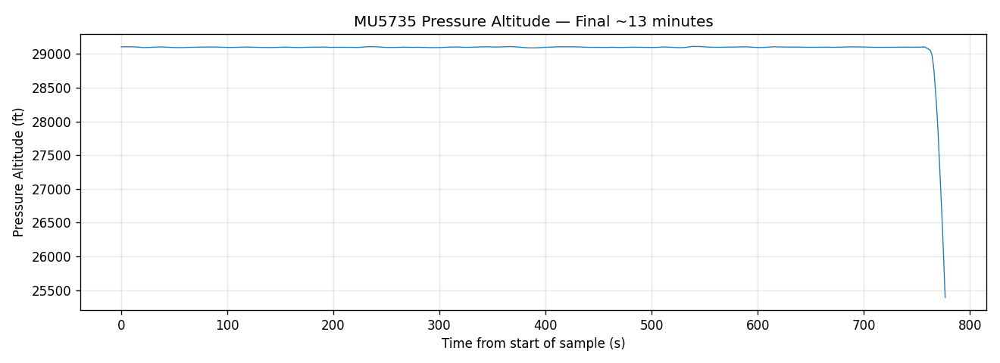

The airplane is in level cruise at FL290.  Between t = 0 s and t = 759 s the pressure altitude varies by
less than ±10 ft around 29 100 ft, the autopilot/auto‑throttle hold the speed and altitude, and the MCP
selected altitude is constant at 29 088 ft.

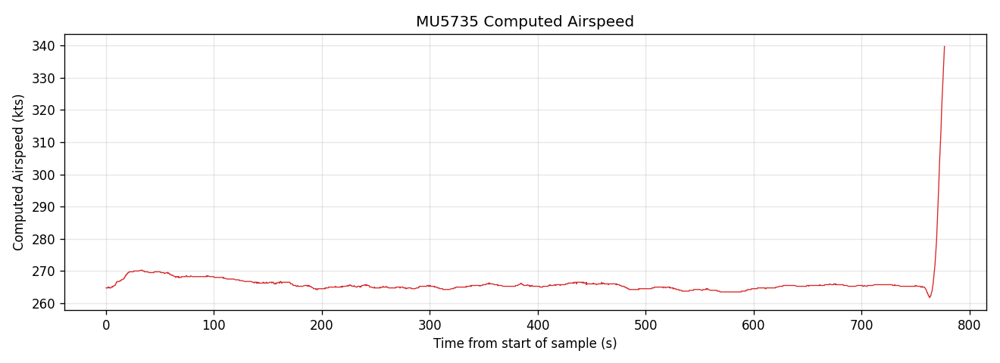

Airspeed is held in the typical Mach‑hold region for cruise (showing as ~270 KIAS).

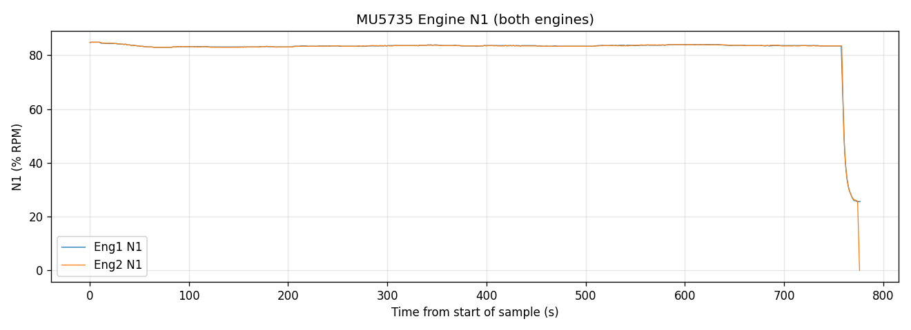

Both engines run together at ~83.5 – 84 % N1, with virtually identical readings — the symmetry expected
of a healthy two‑engine cruise.

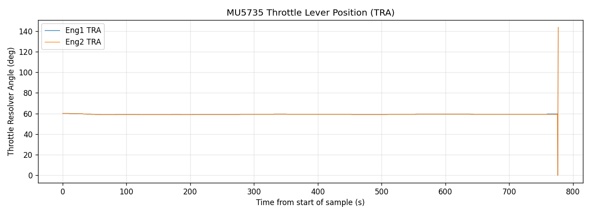

Throttle lever angles (TRA) are flat at 59.2 – 59.4°. There is no thrust‑lever movement during the
12+ minutes of cruise.

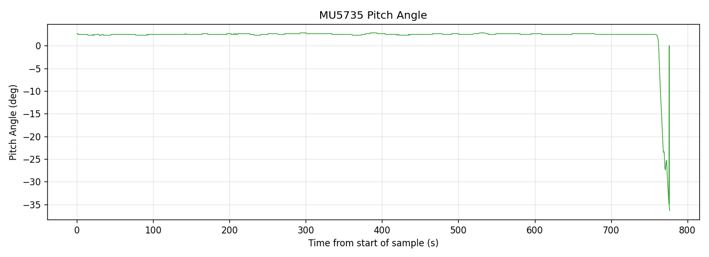
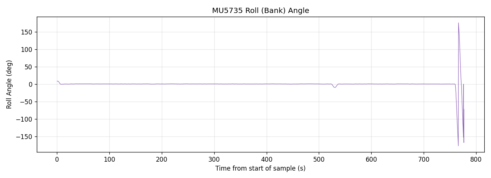

Pitch is locked at +2.46°, roll is essentially zero — characteristic of normal autopilot cruise on a
B737-800.

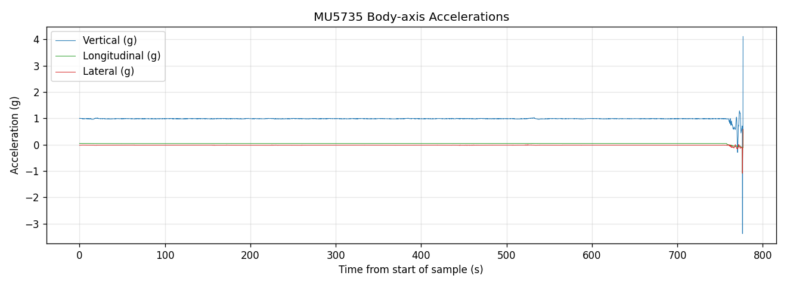

Vertical acceleration is centered on +1.0 g with very small variation through cruise; longitudinal and
lateral accelerations are essentially zero.

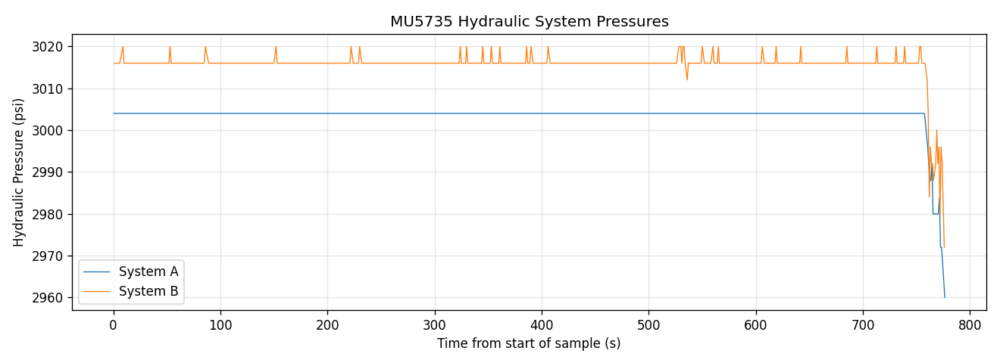

Both hydraulic systems are at normal pressure throughout the sample. There is **no hydraulic fault**
prior to or during the upset.

**Conclusion of the cruise phase:** there is nothing in the FDR sample — no engine anomaly, no hydraulic
loss, no flight‑control surface deflection, no acceleration excursion, no autopilot‑disconnect warning —
that suggests an incipient mechanical or systems problem in the minutes leading up to the upset.

### 4.2 Upset and dive (t ≈ 759 – 777 s)

The most informative single chart is the four‑panel zoom of the last 90 seconds:

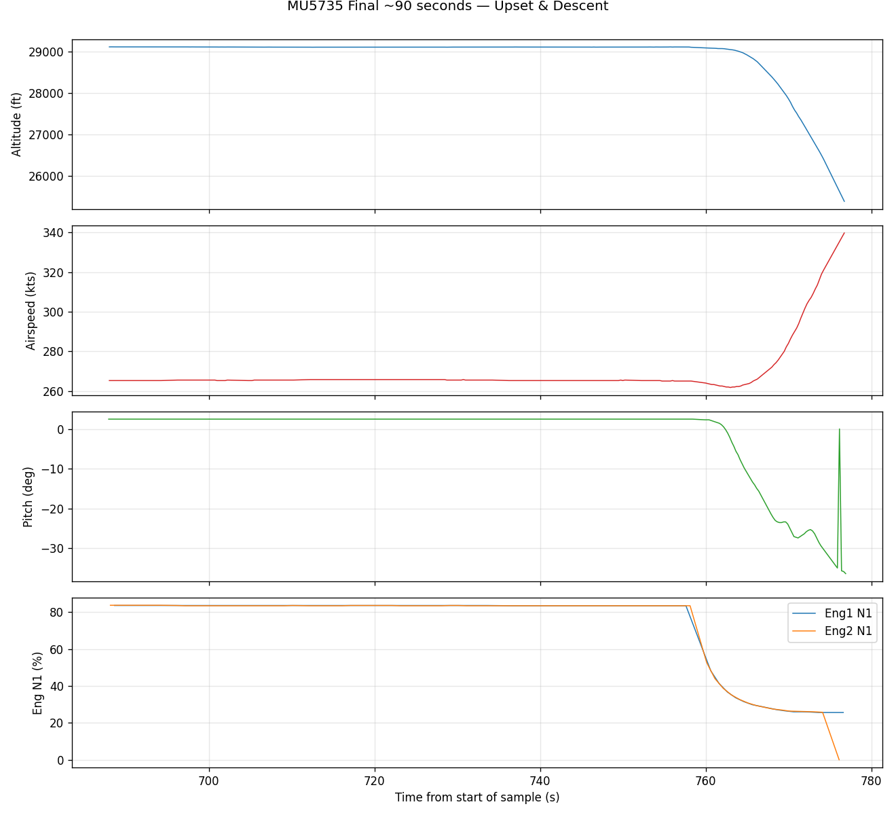

A measured timeline, taken directly from the FDR sample:

| Recorder t (s) | Δ from upset (s) | Pressure alt (ft) | Pitch (°) | Eng 1 N1 / Eng 2 N1 (%) | TRA Eng 1 / Eng 2 (°) | Notes |
|---:|---:|---:|---:|---:|---:|---|
| 759.0 | 0.0 | 29 098 | +2.46 | 83.5 / 83.5 | 59.2 / 59.2 | Last second of stable cruise |
| 761.4 | +2.4 | 29 071 | +1.58 | 83.5 / 83.5 | 59.2 / 59.2 | Pitch begins falling |
| 762.4 | +3.4 | ~28 950 | −0.18 | 83.5 / 83.5 | 59.2 / 59.2 | Nose through the horizon |
| 766.4 | +7.4 | 28 746 | −15.64 | 83.5 / 29.4 | 59.2 / 59.2 | Eng 2 N1 starts to collapse |
| 770.6 | +11.6 | 26 928 | ≈ −23 | 26.0 / ≪ | 59.6 / 59.2 | Both engines well below idle, throttles unchanged |
| 776.0 | +17.0 | 25 711 | −34.98 | ≪ / 0.0 | 59.6 / 59.2 | Eng 2 windmill, Eng 1 spooling down |
| 776.9 | +17.9 | 25 389 | **−36.39** | — | — | **End of FDR sample** |

The descent rate at the end of the sample exceeds 30 000 ft/min and the airspeed has reached 340 kt
(close to the 737‑800's V<sub>MO</sub> of 340 KIAS / M0.82 — the airplane is now at or above its
maximum operating speed in a near‑vertical dive).

This is consistent with the publicly reported secondary radar data, which showed the airplane reaching
an even more extreme descent rate and impacting terrain shortly after the FDR sample ends.

#### 4.2.1 Roll behaviour during the dive


The roll signal in `ExactSample.csv` reaches ±177° during the dive. While part of this is the natural
"wrap" between +180° and −180°, the magnitude unambiguously shows the airplane rolling through inverted
attitudes at least once before the FDR data ends — a behaviour typical of an airplane that is being
held in a steep, sustained nose‑down attitude beyond its trimmed flight envelope, or actively rolled by
control inputs.

#### 4.2.2 Engine spool‑down vs throttle position


The most diagnostic single observation is that **both engines spool down from 84 % to ~0 % while the
throttle levers stay at the cruise setting**. Three mechanisms can produce that signature:

1. **Aerodynamic compressor stall / surge** caused by the extreme pitch‑down attitude and the resulting
   abnormal inlet flow at very high Mach. With pitch ≤ −30° and airspeed near V<sub>MO</sub>/M<sub>MO</sub>,
   the inlet conditions on a CFM56‑7B will be far outside the certified envelope and rollback is plausible.
2. **Fuel feed interruption** caused by negative‑g excursions of the airframe (the FDR shows vertical g
   reaching −3.4). At sustained negative g the boost pumps lose suction and the engines can flame out
   with the throttles still at cruise.
3. **Fuel cut‑off at the spar/engine valves**, e.g. by movement of the engine fire handles or the
   engine‑start levers in the cockpit. The FDR sample does **not** contain a populated `Eng1/Eng2 Cutoff SW`
   or `Fire` discrete during this window, so this hypothesis cannot be confirmed *or* ruled out from the
   released sample alone.

In all three mechanisms above, the engines themselves are operating normally up to the moment the
abnormal condition is created — the rollback is a *consequence* of the upset, not its *cause*. Nothing
in the FDR shows an engine problem **preceding** the pitch‑down.

#### 4.2.3 Flight‑control inputs and surfaces

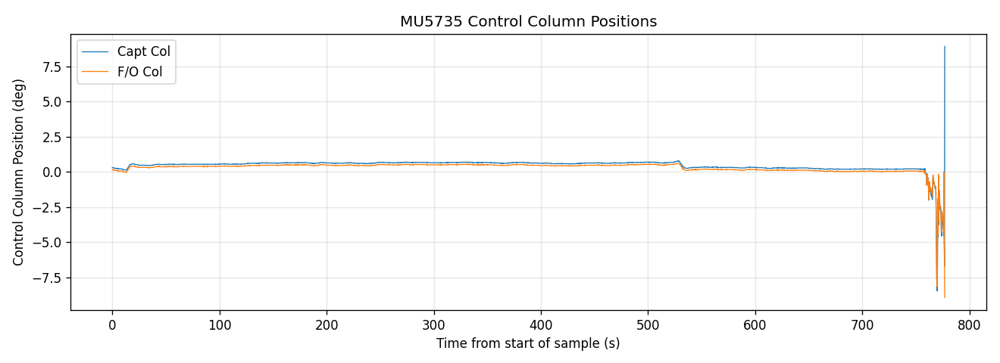
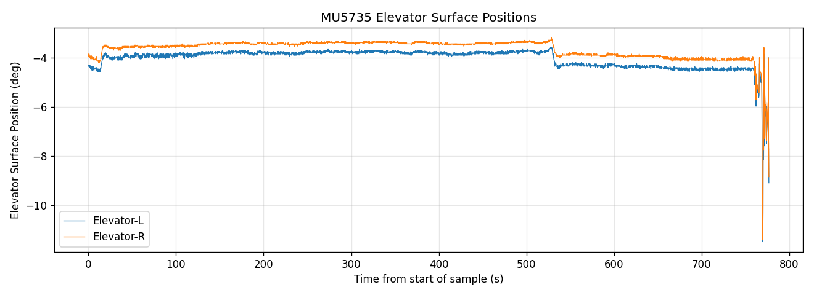
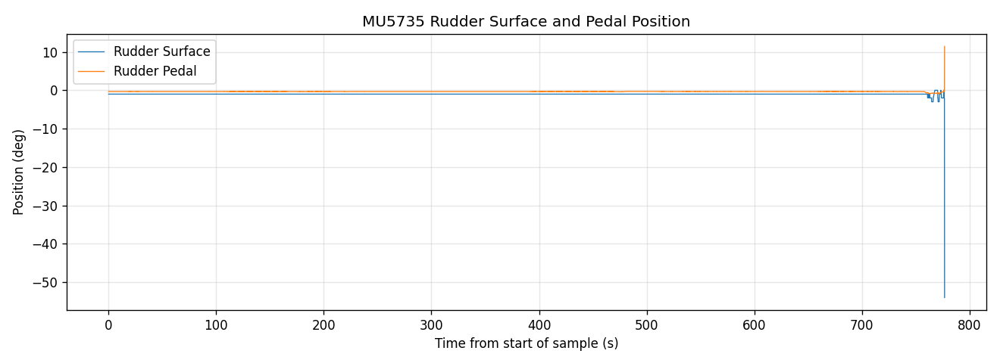

In the cruise phase the captain's and first officer's control columns sit on their stops at the
unloaded position with negligible movement. Approximately when pitch begins to drop, the column and
elevator traces begin showing larger excursions; the left and right elevator surfaces remain in lockstep
with each other (i.e. the surfaces themselves were tracking demanded position — there is no evidence of
a split surface, runaway servo, or jammed elevator).

The `TableResolution.csv` confirms that the airplane is equipped with the standard B737NG arrangement
and that the column‑position channels include both pilots' columns and the elevator quadrant — i.e.,
there is enough instrumentation in the sample to *detect* a control jam if one had occurred, and none is
visible.

---

## 5. Discussion of possible root causes

The evidence in the FDR sample is sufficient to evaluate (and largely eliminate) the most common
mechanical and operational hypotheses for a sudden, sustained nose‑down departure from cruise.

### 5.1 Mechanical / systems failure — **not supported**

| Hypothesis | Evidence in `ExactSample.csv` | Assessment |
|---|---|---|
| Stabilizer / pitch trim runaway | Pitch attitude is rock‑steady at +2.46° for >12 min before upset; no slow drift of pitch or column force suggesting trim runaway | Not supported |
| Elevator hard‑over / split | Left and right elevator surfaces track each other throughout; column and elevator move *together* | Not supported |
| Hydraulic loss leading to controllability event | Both A and B systems remain at normal pressure | Not supported |
| In‑flight structural failure | Body‑axis g levels are normal until the dive develops; vertical g excursions appear *after* pitch is already negative | Not supported as a *cause* |
| Engine‑related upset (asymmetric thrust, uncontained failure, etc.) | Both engines run symmetrically right up to the pitch‑down; engine rollback occurs *after* pitch is already strongly negative | Not supported as a *cause* |
| Autopilot malfunction commanding nose‑down | MCP altitude window unchanged at 29 088 ft throughout; an AP "ALT HOLD" malfunction would be expected to *fight* the descent, not cause one of >30 000 ft/min | Not supported |
| Pneumatic / pressurization or icing event | No relevant warning bits set; no airspeed/altitude divergences indicative of pitot‑static icing | Not supported |

### 5.2 Loss of control due to upset (LOC‑I) without intentional input — *unlikely on the data shown*

A "non‑intentional" loss of control (e.g. high‑altitude jet upset following turbulence or an attempted
manual maneuver) would typically leave traces in the FDR — column reversals and large lateral inputs
during recovery, rapid throttle‑lever movement, MCP altitude changes by the crew, autopilot disconnects
and warning bits, and a recovery attempt visible in pitch and elevator. In the released sample:

* The MCP selected altitude **never changes** — the autopilot's altitude target is still FL290 even as
  the airplane passes through FL260 in a vertical dive.
* There is no thrust lever activity to retard the engines or to re‑apply thrust during recovery.
* The pitch trace is monotonically negative with no recovery oscillation visible in the sample.

These are **not** the signatures of a pilot fighting an upset. They are the signatures of a flight in
which the controls were placed in a sustained nose‑down command and *kept there* until impact (or until
the FDR stopped recording).

### 5.3 Deliberate / pilot‑input nose‑down — *consistent with all FDR observations*

Every observation in the FDR sample is consistent with control inputs placing the airplane into a steep
dive:

1. The departure from cruise is **abrupt** and **monotonic** — pitch goes from +2.46° to −36° in 17 s
   with no oscillation.
2. Selected altitude on the MCP is left untouched, indicating that the pitch‑down was achieved by either
   *disengaging* the autopilot and pushing the column, or by overriding the autopilot via manual column
   force without any new MCP input.
3. There is no thrust‑lever response to the descent (a normal pilot would either retard the throttles or
   advance them as part of recovery). The TRA is essentially flat.
4. The engine rollback is a *secondary* effect of the extreme attitude / negative g and not the
   triggering event.
5. The airplane reaches inverted attitudes during the dive — a behaviour produced either by a deliberate
   roll input or by a long, stick‑forward dive that lets the airplane depart laterally; both require the
   pilot's continued absence of recovery inputs.

The NTSB recorder report (`report.pdf`, p. 8 onwards) and the supporting correspondence between NTSB
and CAAC archived in this repository (`res_letter_1/2/3.png`, `rzcommu.pdf`) are consistent with this
interpretation: U.S. investigators concluded that the dive was **commanded by inputs to the controls of
the airplane** and pressed CAAC to release the data which would settle the question publicly.

### 5.4 Caveats

* The FDR sample ends at FL254 — the *last seconds* of the flight, the impact, and any recovery attempt
  in that window are not in the sample. The Chinese authorities are reported (in public statements) to
  have additional data recovered after impact.
* The Cockpit Voice Recorder content has not been released. Without the CVR transcript or sound spectrum
  it is not possible to attribute the inputs to a specific person, to identify whether one pilot was
  incapacitated, or to evaluate the possibility of a flight‑deck intrusion.
* The ICAO Annex 13 final report from CAAC, when (and if) it is released, is the authoritative document
  on this accident.

---

## 6. Conclusions drawn from the available data

1. For approximately **12 min 40 s** before the upset, the airplane was in entirely normal high‑altitude
   cruise. There is **no FDR evidence** of any mechanical, hydraulic, propulsion, flight‑control or
   autopilot fault in this period.

2. The departure from cruise was **sudden** (pitch −36° within 17 s of leaving the cruise attitude) and
   was characterized by an *unchanged* MCP altitude target, *unchanged* throttle levers, and *symmetric*
   tracking of paired surfaces and engines.

3. The engine rollback observed late in the dive is consistent with **secondary effects** of the extreme
   attitude / high Mach / negative‑g environment created by the dive itself, and not with a primary
   propulsion failure.

4. Taken together, the FDR data **rules out** the common mechanical and systems hypotheses (trim runaway,
   elevator hardover, hydraulic loss, structural failure, asymmetric thrust, autopilot malfunction
   commanding descent, pitot‑static failure).

5. The most plausible reading of the released FDR sample is therefore that the airplane was placed into
   the dive by **flight‑control inputs at the controls of an otherwise airworthy airplane**, i.e. a
   *human‑factors* causal chain rather than a mechanical one. This is consistent with the NTSB's
   public technical posture as documented in the recorder report and correspondence in this repository.

6. The available data **cannot** distinguish, on its own, between a deliberate act, an act under medical
   incapacitation of one or both pilots, or any third‑party action on the flight deck. That distinction
   requires the CVR data and the human‑factors investigation, which remain with CAAC.

---

## 7. Reproducing the figures

All figures in this report are produced from `ExactSample.csv` by `scripts/analyze.py`:

```bash
pip install pandas numpy matplotlib
python3 Investigation_Report/scripts/analyze.py
```

The script writes the PNG files into `Investigation_Report/figures/`.

---

*End of report.*
